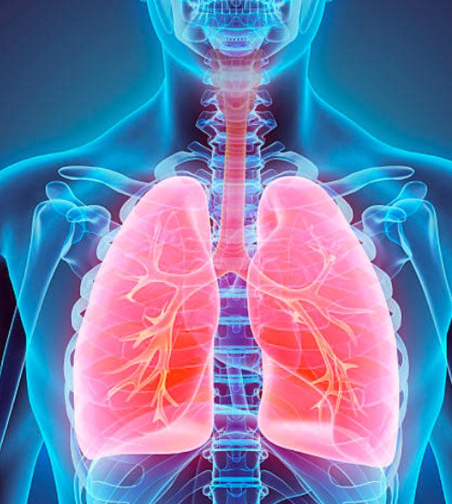
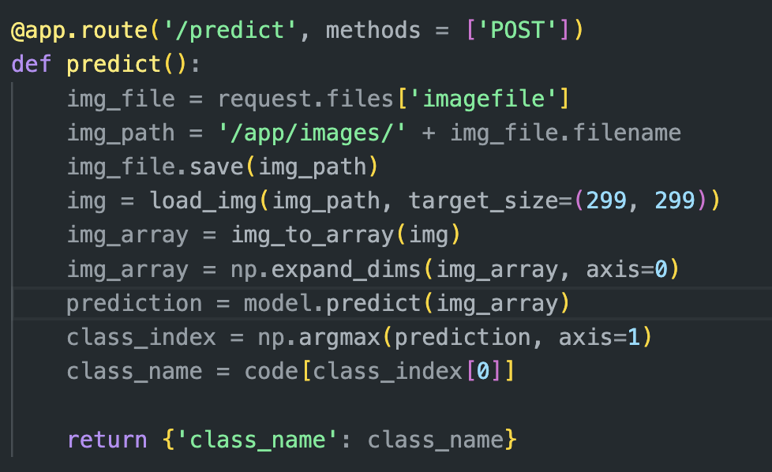

# Lung ct detection 

#### Project Status: [Completed]

## Project Intro/Objective
deeplearning model resposible for detecting ct scan for lunges 

### Methods Used
* data augmentaion
* pre trained model VGG16
* transfer learning
* Deep leanring, CNN
* Early stopping
  
### Technologies
* pandas, numpy, matplotlib
* tensotflow
* glob
* scikit learn 

## Project Description
the purpose of this project is to create a deeplearning model resposible for detecting ct scan for lunges predicting if it's one of the following classes 
**{0:'failure',1:'normal',2:'Covid',3:'lung atama'}** 
then the model should be deployed on mobile application and all data exchange will be done by GET and POST request, provided down screenshot of a post request to my local host running the model and getting back predictions in a json format 

## image preprocessing

it's essential to preprocess the image uploaded before passing it to the model  
and getting back the prediction 
and all these preprocesssing procedure should be matched to whatever your model expecting to get to start getting predictions

## Needs of this project

- data processing/cleaning
- app developer
- Deep learning model

## Getting Started

1. pull the docker image from [Here](https://hub.docker.com/repository/docker/omar88/docker_app/tags) 
2. Data source:
    
3. Data processing/transformation scripts are being kept [here](Repo folder containing data processing scripts/notebooks)
4. etc...

*If your project is well underway and setup is fairly complicated (ie. requires installation of many packages) create another "setup.md" file and link to it here*  

5. Follow setup [instructions](Link to file)

## Featured Notebooks/Analysis/Deliverables
* [Notebook/Markdown/Slide Deck Title](link)
* [Notebook/Markdown/Slide DeckTitle](link)
* [Blog Post](link)

## Contributing DSWG Members

**Team Leads (Contacts) : [Full Name](https://github.com/[github handle])(@slackHandle)**

#### Other Members:

|Name     |  Slack Handle   | 
|---------|-----------------|
|[Full Name](https://github.com/[github handle])| @johnDoe        |
|[Full Name](https://github.com/[github handle]) |     @janeDoe    |

## Contact
* If you haven't joined the SF Brigade Slack, [you can do that here](http://c4sf.me/slack).  
* Our slack channel is `#datasci-projectname`
* Feel free to contact team leads with any questions or if you are interested in contributing!
