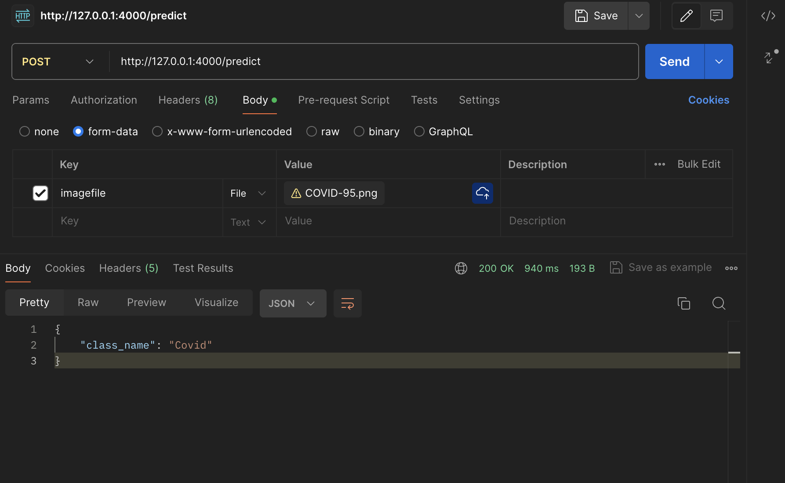

# lung ct detection 
This project is a part of the [Data Science Working Group](http://datascience.codeforsanfrancisco.org) at [Code for San Francisco](http://www.codeforsanfrancisco.org).  Other DSWG projects can be found at the [main GitHub repo](https://github.com/sfbrigade/data-science-wg).

#### -- Project Status: [Active, On-Hold, Completed]

## Project Intro/Objective
the purpose of this project is to create a deeplearning model resposible for detecting whether the provided ct scan for lunges is one of the following classes **{0:'failure',1:'normal',2:'Covid',3:'lung atama'}**

### Methods Used
* Inferential Statistics
* Machine Learning
* Data Visualization
* Predictive Modeling
* etc.

### Technologies
* R 
* Python
* D3
* PostGres, MySql
* Pandas, jupyter
* HTML
* JavaScript
* etc. 

## Project Description

## Needs of this project

- frontend developers
- data exploration/descriptive statistics
- data processing/cleaning
- statistical modeling
- writeup/reporting
- etc. (be as specific as possible)

## Getting Started

1. Clone this repo (for help see this [tutorial](https://help.github.com/articles/cloning-a-repository/)).
2. Raw Data is being kept [here](Repo folder containing raw data) within this repo.

    *If using offline data mention that and how they may obtain the data from the froup)*
    
3. Data processing/transformation scripts are being kept [here](Repo folder containing data processing scripts/notebooks)
4. etc...

*If your project is well underway and setup is fairly complicated (ie. requires installation of many packages) create another "setup.md" file and link to it here*  

5. Follow setup [instructions](Link to file)

## Featured Notebooks/Analysis/Deliverables
* [Notebook/Markdown/Slide Deck Title](link)
* [Notebook/Markdown/Slide DeckTitle](link)
* [Blog Post](link)

## Contributing DSWG Members

**Team Leads (Contacts) : [Full Name](https://github.com/[github handle])(@slackHandle)**

#### Other Members:

|Name     |  Slack Handle   | 
|---------|-----------------|
|[Full Name](https://github.com/[github handle])| @johnDoe        |
|[Full Name](https://github.com/[github handle]) |     @janeDoe    |

## Contact
* If you haven't joined the SF Brigade Slack, [you can do that here](http://c4sf.me/slack).  
* Our slack channel is `#datasci-projectname`
* Feel free to contact team leads with any questions or if you are interested in contributing!
